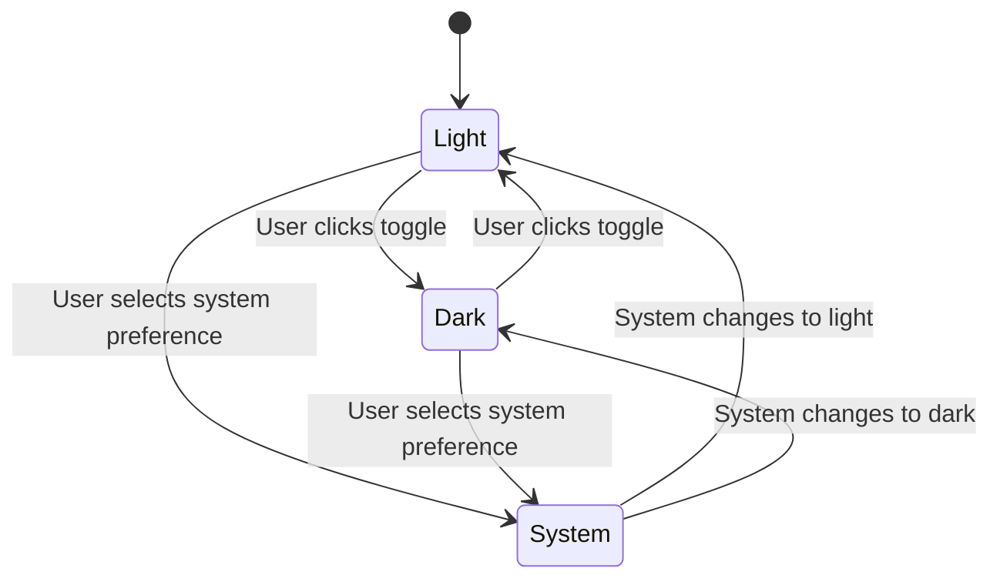
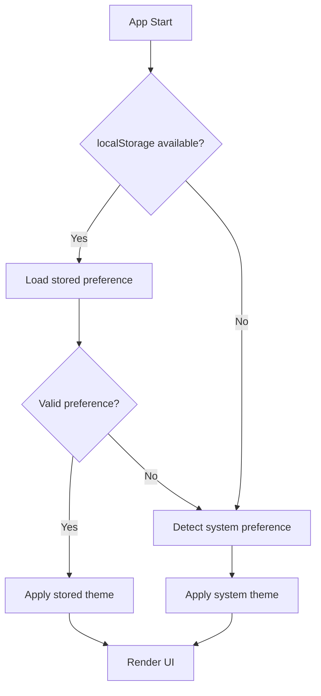

# Data Model: Dark Mode

**Feature**: Dark Mode  
**Date**: 2026-02-15  
**Phase**: 1 - Design

## Core Entities

### ThemePreference

Represents the user's theme selection and system behavior.

```typescript
interface ThemePreference {
  /** Current theme state */
  theme: 'light' | 'dark' | 'system';
  /** Whether theme preference should persist across sessions */
  persist: boolean;
  /** Timestamp of last theme change */
  lastChanged: number;
}
```

### SystemTheme

Represents the operating system's current theme preference.

```typescript
interface SystemTheme {
  /** System's current color scheme preference */
  prefersColorScheme: 'light' | 'dark' | 'no-preference';
  /** Whether system supports color scheme detection */
  supported: boolean;
}
```

### ThemeState

Combined state representing the effective theme applied to the UI.

```typescript
interface ThemeState {
  /** The theme currently applied to the UI */
  effectiveTheme: 'light' | 'dark';
  /** User's preference setting */
  userPreference: ThemePreference;
  /** System's current preference */
  systemPreference: SystemTheme;
  /** Whether high contrast mode is active */
  highContrastMode: boolean;
}
```

## State Transitions

### Theme Toggle Flow



### Initialization Flow



## Validation Rules

### Theme Preference Validation

- `theme` must be one of: 'light', 'dark', 'system'
- `persist` must be boolean
- `lastChanged` must be valid Unix timestamp
- Invalid localStorage data should be ignored and fall back to system preference

### System Theme Detection

- `prefersColorScheme` detection uses `window.matchMedia('(prefers-color-scheme: dark)')`
- `supported` is true if `matchMedia` is available and responds
- `no-preference` used when system doesn't express a preference

### High Contrast Mode Detection

- Uses `window.matchMedia('(prefers-contrast: high)')`
- Takes precedence over dark mode when active
- Falls back gracefully if not supported

## Storage Schema

### localStorage Key

```typescript
const THEME_STORAGE_KEY = 'speedreader.theme';
```

### Stored Data Format

```typescript
// Simple string value
'light' | 'dark' | 'system';
```

### Storage Validation

- Validate string against allowed theme values
- Handle invalid values gracefully by using system preference

## Performance Considerations

- Theme state updates should be batched to prevent re-renders
- System theme listeners should be properly cleaned up
- localStorage reads/writes minimized to essential operations
- Theme transitions use CSS for optimal performance

## Error Handling

- localStorage quota exceeded: fall back to system preference
- Invalid string values: fall back to system preference
- Media query not supported: assume 'no-preference'
- Theme toggle errors: maintain current theme, use simple try-catch
